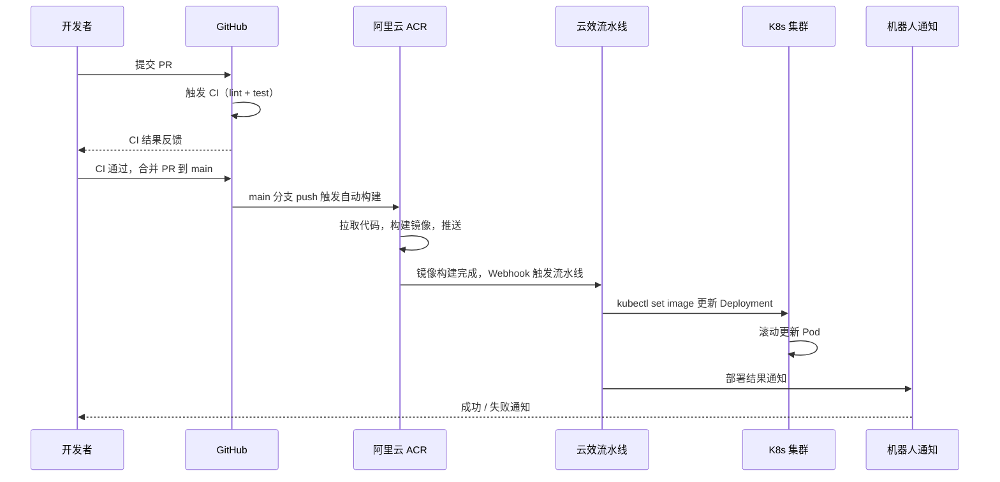

## 背景

团队的后端项目基于 Django 和 FastAPI，早期部署方式是登录服务器手动拉代码、装依赖、重启服务。项目少的时候还能应付，但随着服务数量增长到十几个，每次发版都变成了体力活——环境不一致、依赖冲突、回滚困难，甚至出过因为某台机器 Python 版本不对导致线上报错的事故。

后来我们逐步把所有 Python 服务迁移到 Docker + Kubernetes，并打通了从代码提交到自动部署的完整流水线。这篇文章记录这套方案的落地过程。

## Dockerfile 编写

Python 项目的镜像构建有几个实际需要注意的点。

### 基础镜像选择

生产环境用 `python:3.11-slim`，不用 `alpine`。原因很现实：很多 Python 包（比如 `mysqlclient`、`Pillow`）依赖系统库，alpine 下需要装一堆编译工具，构建慢且容易出问题。slim 镜像体积可控，兼容性好。

### 多阶段构建

一个 FastAPI 项目的 Dockerfile 大概长这样：

```dockerfile
FROM python:3.11-slim AS builder

WORKDIR /app
COPY requirements.txt .
RUN pip install --no-cache-dir --prefix=/install -r requirements.txt

FROM python:3.11-slim

WORKDIR /app
COPY --from=builder /install /usr/local
COPY . .

EXPOSE 8000
CMD ["gunicorn", "app.main:app", "-w", "4", "-k", "uvicorn.workers.UvicornWorker", "-b", "0.0.0.0:8000"]
```

把依赖安装和代码复制分成两个阶段，利用 Docker 的层缓存——只要 `requirements.txt` 没变，依赖层就不会重新构建，日常迭代构建时间从几分钟缩短到十几秒。

### .dockerignore

别忘了加 `.dockerignore`，把 `.git`、`__pycache__`、`.env`、`node_modules` 这些排除掉，否则构建上下文会很大，推送也慢。

## 镜像管理

镜像构建完需要推到镜像仓库。我们用的是阿里云容器镜像服务（ACR），每个项目对应一个仓库，镜像 tag 用 git commit hash 前 8 位，方便定位问题时追溯代码版本。

ACR 有一个好用的功能：可以配置构建规则，绑定代码仓库后，指定分支有新的 push 时自动触发镜像构建。我们的用法是：`main` 分支合并后，ACR 自动拉取代码、构建镜像并推送。不需要在 CI 里额外处理 `docker build` 和 `docker push`，构建过程在阿里云侧完成，也省了 CI 机器的资源。

## Kubernetes 部署

### 基本资源配置

一个典型的 Deployment：

```yaml
apiVersion: apps/v1
kind: Deployment
metadata:
  name: api-server
  namespace: production
spec:
  replicas: 3
  strategy:
    type: RollingUpdate
    rollingUpdate:
      maxSurge: 1
      maxUnavailable: 0
  selector:
    matchLabels:
      app: api-server
  template:
    metadata:
      labels:
        app: api-server
    spec:
      containers:
        - name: api-server
          image: registry.cn-hangzhou.aliyuncs.com/your-namespace/api-server:latest
          ports:
            - containerPort: 8000
          envFrom:
            - configMapRef:
                name: api-server-config
            - secretRef:
                name: api-server-secrets
          resources:
            requests:
              cpu: 250m
              memory: 256Mi
            limits:
              cpu: '1'
              memory: 512Mi
          readinessProbe:
            httpGet:
              path: /health
              port: 8000
            initialDelaySeconds: 5
            periodSeconds: 10
          livenessProbe:
            httpGet:
              path: /health
              port: 8000
            initialDelaySeconds: 15
            periodSeconds: 20
```

几个关键配置：

- **`maxUnavailable: 0`**：滚动更新时保证不会有 Pod 下线导致服务中断
- **`resources`**：必须设置，不然一个内存泄漏的服务能把整个 Node 拖垮
- **`readinessProbe`**：确保 Pod 真正能处理请求后才接入流量。Django 和 FastAPI 都应该加一个 `/health` 接口
- **环境变量分离**：非敏感配置放 ConfigMap，数据库密码等放 Secret

### Service 和 Ingress

Service 做集群内部负载均衡，Ingress 处理外部流量和域名路由：

```yaml
apiVersion: v1
kind: Service
metadata:
  name: api-server
  namespace: production
spec:
  selector:
    app: api-server
  ports:
    - port: 80
      targetPort: 8000
---
apiVersion: networking.k8s.io/v1
kind: Ingress
metadata:
  name: api-server
  namespace: production
  annotations:
    nginx.ingress.kubernetes.io/proxy-body-size: '20m'
spec:
  rules:
    - host: api.example.com
      http:
        paths:
          - path: /
            pathType: Prefix
            backend:
              service:
                name: api-server
                port:
                  number: 80
```

## CI/CD 流水线

这是整套方案里最省心的部分，一旦配好基本不用管。完整流程：



### GitHub CI

PR 阶段跑 lint 和测试，用 GitHub Actions：

```yaml
name: CI
on:
  pull_request:
    branches: [main]

jobs:
  check:
    runs-on: ubuntu-latest
    steps:
      - uses: actions/checkout@v4
      - uses: actions/setup-python@v5
        with:
          python-version: '3.11'
      - run: pip install -r requirements-dev.txt
      - run: ruff check .
      - run: pytest --tb=short -q
```

CI 不过不允许合并。这一步卡住了大部分低级错误。

### ACR 自动构建

在阿里云 ACR 控制台绑定 GitHub 仓库，设置构建规则：

- 触发条件：`main` 分支有新 push
- Dockerfile 路径：`/Dockerfile`
- 镜像 Tag：`latest` + commit hash

构建完成后，ACR 可以配置触发器，发送 Webhook 到下游。

### 云效流水线

收到 ACR 的 Webhook 后，云效流水线执行部署：

1. 拉取最新镜像信息
2. 执行 `kubectl set image` 更新 Deployment 的镜像版本
3. 等待滚动更新完成
4. 发送部署结果到钉钉/飞书机器人

整条链路从 PR 合并到线上生效，通常在 5 分钟内完成。

## 踩过的坑

### 时区问题

slim 镜像默认是 UTC 时区，日志和定时任务的时间都会对不上。Dockerfile 里加一行：

```dockerfile
RUN ln -sf /usr/share/zoneinfo/Asia/Shanghai /etc/localtime
```

### 优雅退出

Kubernetes 停止 Pod 时会发送 SIGTERM，但 Gunicorn 默认的 worker 超时是 30 秒。如果请求处理时间可能较长，需要在 Deployment 里设置 `terminationGracePeriodSeconds`，同时 Gunicorn 配置 `--graceful-timeout`，让 worker 有足够时间处理完当前请求。

### 镜像体积

最初没用多阶段构建，镜像接近 1.5G，拉取和启动都很慢。优化后 slim + 多阶段构建，镜像缩到 200-300MB，Pod 启动时间从几十秒缩短到几秒。

### 健康检查配置

`initialDelaySeconds` 设太短会导致 Pod 反复重启——Django 项目启动有预热过程（migration check、collectstatic 等），需要留够时间。我们一般设 15-30 秒。

## 总结

这套方案运行了一年多，整体稳定。核心思路就三点：

1. **Dockerfile 标准化**：每个项目统一使用多阶段构建，基础镜像版本锁定，避免环境差异
2. **镜像构建交给 ACR**：不在 CI 机器上构建和推送镜像，利用 ACR 的自动构建能力
3. **流水线自动化**：从代码合并到线上部署全程无人工干预，靠 Webhook 串联各环节

对于中小团队来说，不需要自建复杂的 DevOps 平台。GitHub Actions 做 CI，ACR 做镜像管理和自动构建，云效做 CD，三个现成的服务串起来就是一条完整的流水线。
