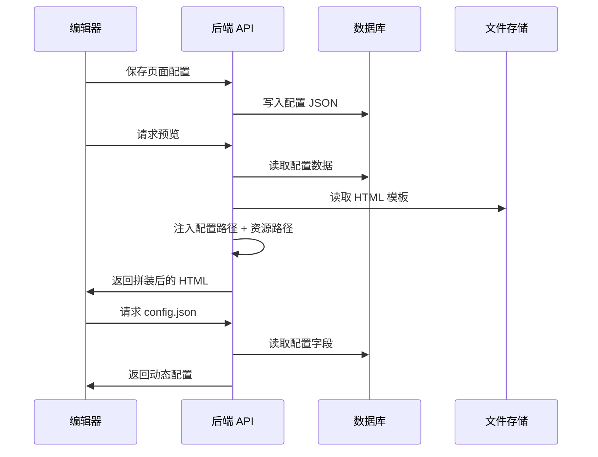
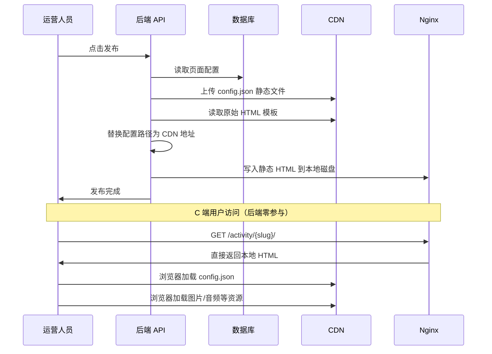
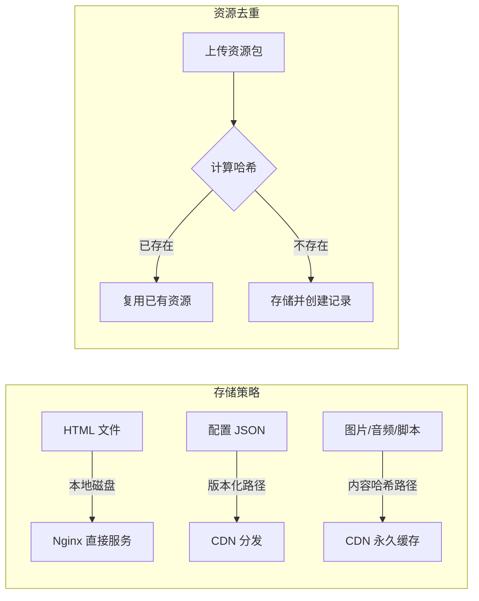
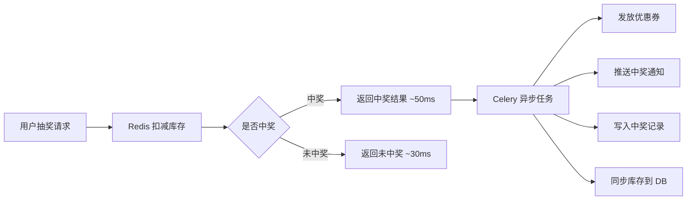
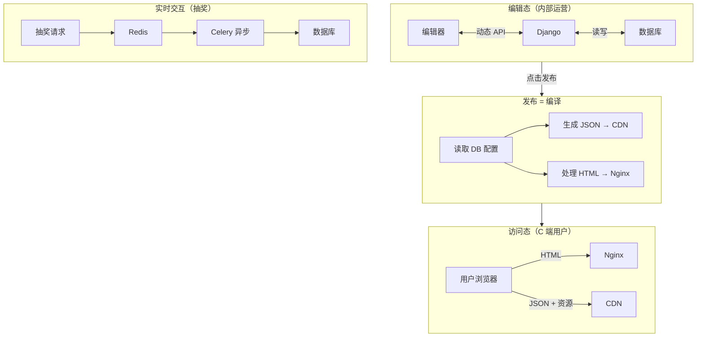

## 背景

我之前负责一套 H5 营销系统的后端开发，系统的核心能力是让运营人员通过可视化编辑器搭建营销页面——包括 H5 小游戏和抽奖活动。用户在编辑器中配置文本、图片、游戏组件，通过接口实时预览，确认后点击发布上线，供 C 端用户访问。

后端基于 Python（Django），整体架构围绕一个核心设计展开：**编辑态与发布态的彻底分离**。编辑时走动态接口，发布后全部静态化，C 端访问完全脱离后端服务。

系统需要承载大量营销活动，单个活动推广期间可能面临数十万甚至上百万的访问量。

## 面临的问题

最初的方案里，C 端用户每次打开活动页都会触发后端接口——拉配置、拉游戏数据、拉抽奖信息。流量小的时候没有感知，但活动规模上来后，几个瓶颈很快就暴露了：

- **接口压力集中**：每个 PV 都要请求后端获取页面配置，活动高峰期 QPS 直接打满应用服务。
- **数据库连接耗尽**：页面配置存在 JSONField 里，高并发读请求让数据库连接池迅速拉满。
- **抽奖场景更极端**：用户在活动开始的头几分钟集中涌入，抽奖接口读写混合压力巨大。
- **发奖流程阻塞**：中奖后的发券、推送、记录流水等同步执行，接口响应被拖到秒级。

本质上是同一个问题：**不该让后端承担它不需要承担的流量**。

## 解决方案

### 静态化：HTML 与 JSON 分离

这是整套方案的核心。我们在架构层面将编辑态和发布态做了彻底的切割。

**编辑态（预览）**：运营人员在编辑器修改配置后，通过 API 实时保存到数据库。预览时后端从数据库读取配置，动态注入到 HTML 模板中返回。这个阶段只有内部人员使用，并发可以忽略。

**发布态（静态化）**：点击发布后触发一套"编译"流程，将所有动态数据转化为静态产物：

1. 从数据库读取页面配置，序列化为静态 JSON 文件上传到 CDN。
2. 读取 HTML 模板，将动态接口引用替换为 CDN 上的 JSON 路径，注入资源 base 路径。
3. 处理后的 HTML 写入本地磁盘，由 Nginx 直接服务。

发布完成后，C 端用户的整个访问链路——**HTML 来自 Nginx，配置和资源来自 CDN，完全不经过 Django**。后端压力直接归零。

对于多页面游戏，系统会遍历所有页面结构，逐个生成对应的静态 HTML 和配置 JSON，按版本号组织目录，保证每次发布互不冲突。

### CDN 分发与资源去重

静态资源的存储做了两层设计：

**内容寻址去重**：资源上传时计算文件内容的哈希值，相同哈希直接复用已有文件，不重复存储。多个页面可以共享同一份资源包，存储成本显著下降。

**版本化配置路径**：配置文件按 `/{slug}/{version}/config.json` 的路径存储，每次发布生成新版本号。静态资源则按内容哈希路径永久缓存——哈希不变，内容就不变，天然适合强缓存。

### Redis 缓存

抽奖组件是系统中少数仍需后端实时处理的场景，用 Redis 做了多层保护：

- **奖品库存**：活动开始前将奖品信息和库存加载到 Redis，抽奖时直接在 Redis 中扣减，避免打到数据库。
- **排行榜**：用 ZSET 实现游戏排行榜，`ZADD` 写入分数，`ZREVRANGE` 获取排名，O(log N) 复杂度轻松扛住高并发。
- **热数据缓存**：抽奖规则、概率配置等读多写少的数据缓存在 Redis 中，设置合理 TTL。

### Celery 异步处理

中奖后的发奖流程天然适合异步化。抽奖接口只做两件事——扣减 Redis 库存、返回中奖结果。发放优惠券、推送消息、写入流水等后续操作全部推到 Celery Worker 异步执行。

接口响应时间从秒级降到毫秒级。用户看到中奖动画时，后台 Worker 已经在异步处理发奖了。

## 架构设计思路

整个架构的核心逻辑可以用一句话概括：**编辑走接口，访问走文件**。

编辑器面向的是内部运营人员，并发量低，Django 动态接口完全够用。发布动作本质上是一次"编译"——把数据库中的动态数据编译成静态产物（HTML + JSON），之后所有 C 端流量由 Nginx 和 CDN 承接。

抽奖等必须实时交互的场景，通过 Redis 把数据库挡在后面，Celery 把耗时逻辑推到后台。思路就是：**能静态化的全静态化，不能静态化的尽量缓存，缓存之后的写操作尽量异步**。

## 优化效果

方案上线后效果明显：

- 活动页访问完全不经过 Django，后端 QPS 压力下降 **90%** 以上。
- 页面加载依赖 CDN 节点，响应时间从 300-500ms 降到 **50ms 以内**。
- 抽奖接口在万级并发下响应时间稳定在 50ms 左右。
- 数据库连接数从高峰满载降到日常 **20% 以下**。

## 总结

这套方案没有用到什么新奇的技术——Nginx、CDN、Redis、Celery 都是成熟工具。关键是想清楚一件事：哪些流量真正需要后端处理，哪些只是在浪费资源。

营销页面发布后内容就不会变，没必要每次访问都查数据库。把这个认知落到架构上——静态化 + CDN——就解决了绝大部分问题。剩下的实时场景用 Redis + Celery 兜底。

性能优化最重要的不是堆技术栈，而是理解业务的流量特征，把流量引导到该去的地方。
