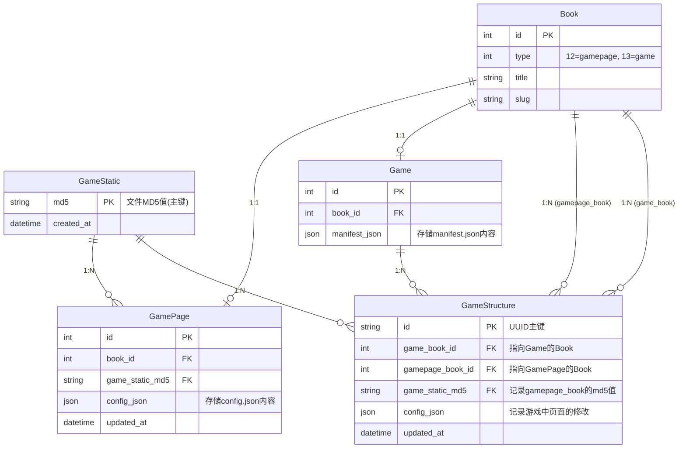
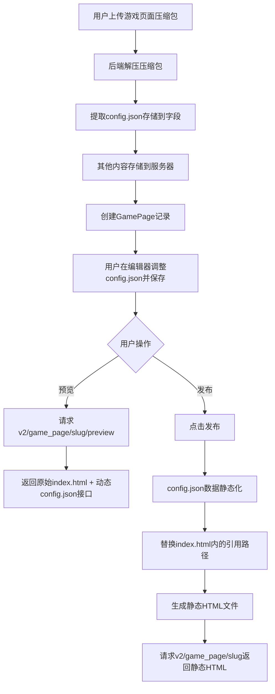
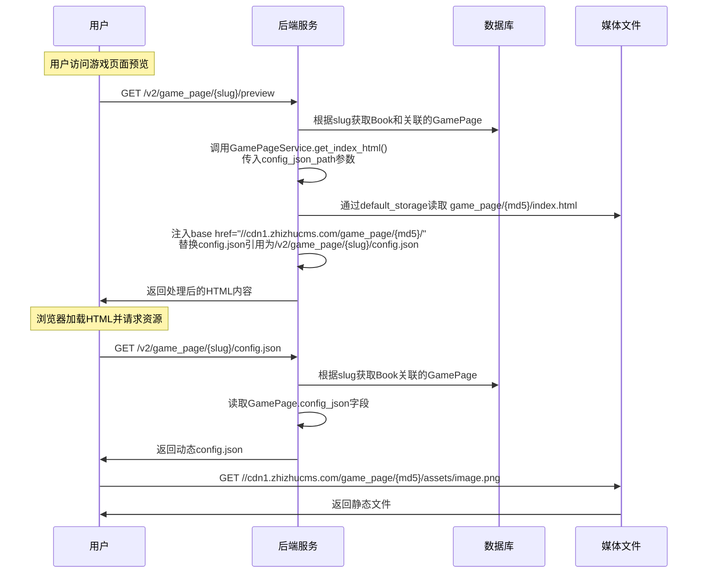
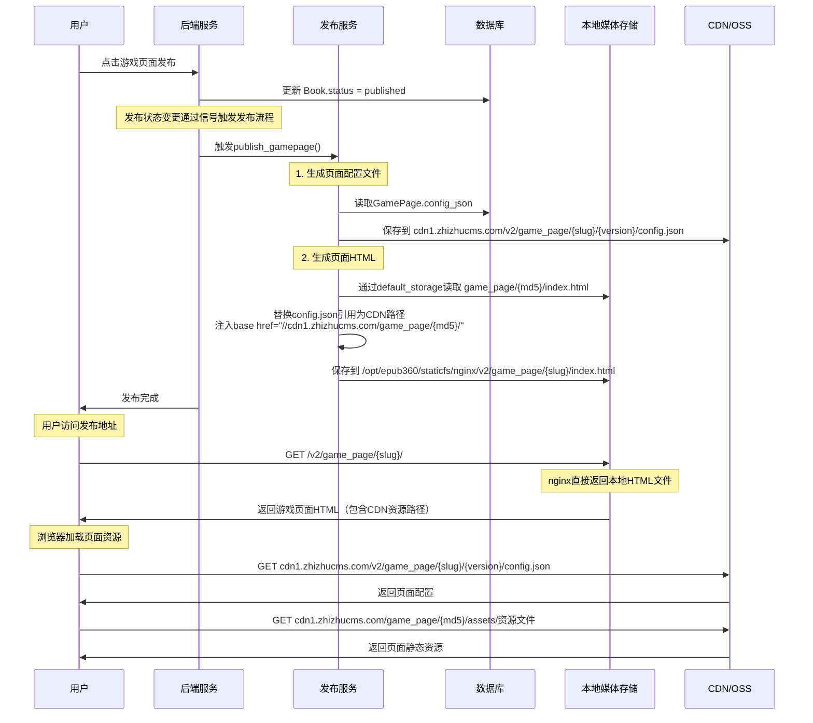
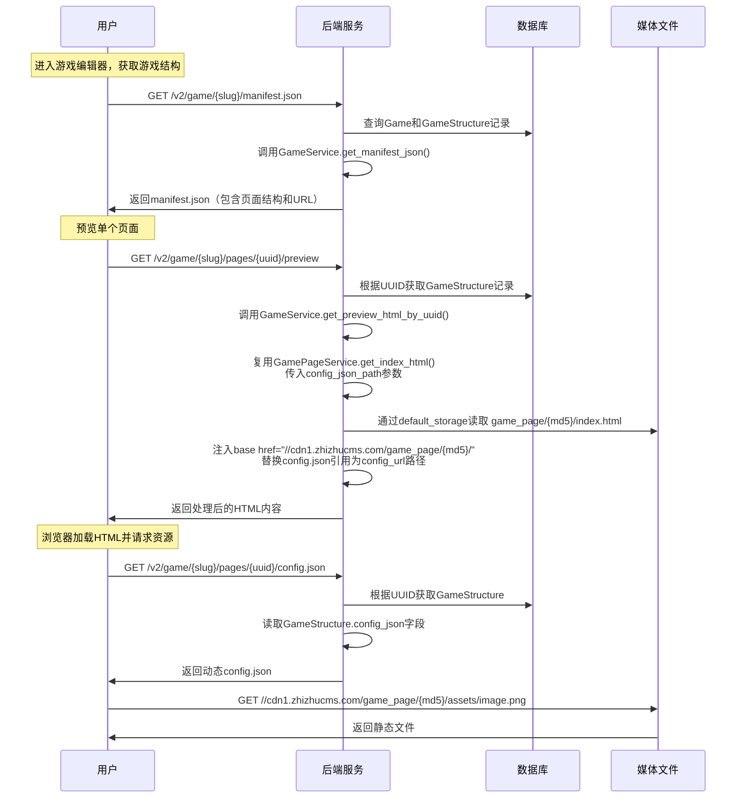
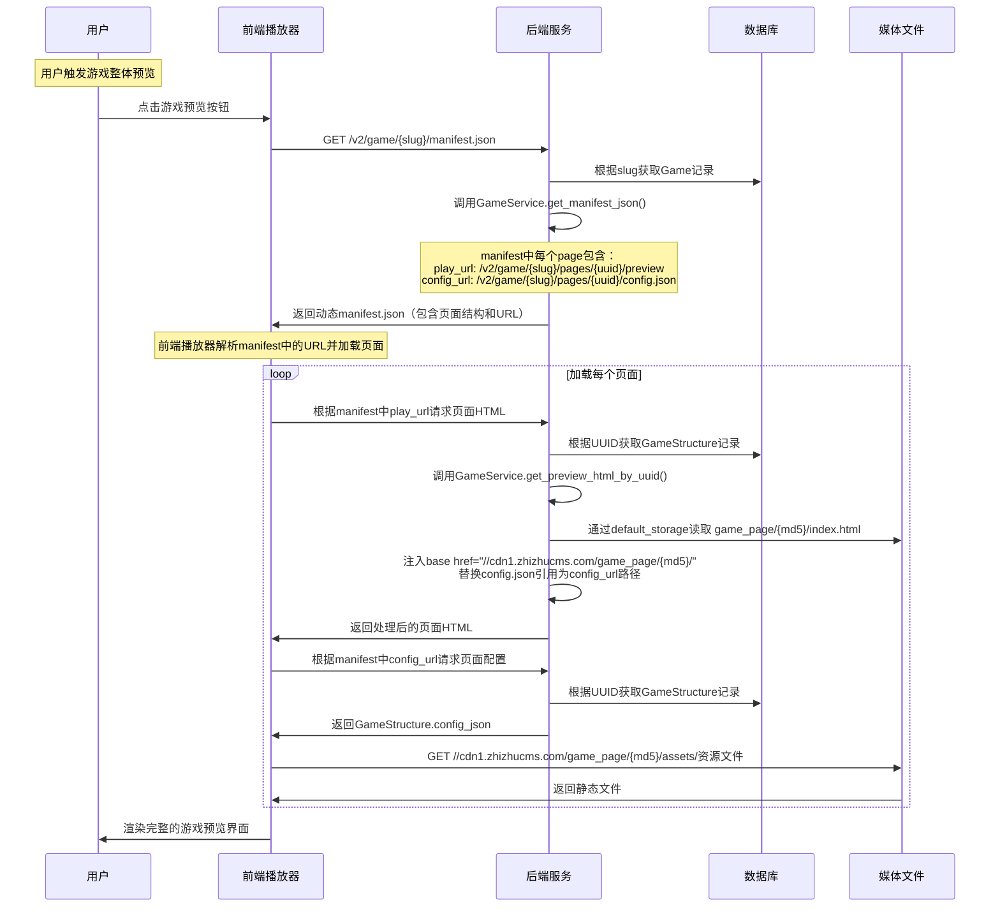
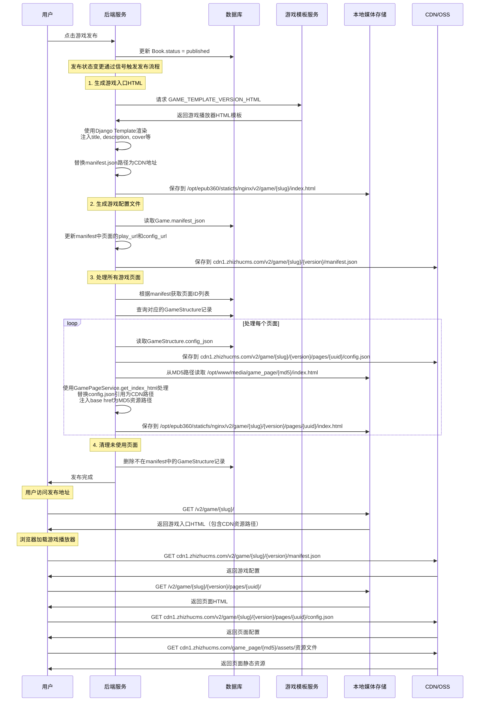

# 游戏系统设计文档

## 1. 项目概述

### 1.1 背景
基于现有的epub-python-book系统，扩展支持游戏类型的作品。系统需要支持两种游戏形式：
- **单页面游戏**：独立的游戏页面，包含完整的游戏逻辑
- **多页面游戏**：由多个页面组合而成的复杂游戏作品

### 1.2 目标
1. 扩展现有Book模型，支持游戏类型
2. 实现单页面游戏的管理和播放
3. 实现多页面游戏的组合和管理
4. 支持游戏包的上传和解析
5. 提供完整的API接口和管理界面

## 2. 系统架构设计

### 2.1 整体架构

```
现有系统
├── Book (type扩展)
│   ├── gamepage (12) - 游戏页面
│   └── game (13) - 游戏作品
│
新增模块
├── epub_gamepage (单页面管理)
│   ├── models.py - GamePage模型
│   ├── views.py - 页面API
│   ├── serializers.py - 序列化器
│   └── tasks.py - 异步任务
│
└── epub_game (游戏管理)
    ├── models.py - Game, GameStructure模型
    ├── views.py - 游戏API
    ├── serializers.py - 序列化器
    └── tasks.py - 异步任务
```

### 2.2 Book类型扩展

```python
# epub_python_book/settings/base.py
APP_TYPE_CHOICES = Choices(
    ...
    (12, "gamepage", "游戏页面"),  # 新增
    (13, "game", "游戏"),         # 新增
)
```

## 3. 数据模型设计

### 3.1 表关系图



### 3.2 关系说明

1. **Book → GamePage (1:1)**：每个游戏页面对应一个Book记录
2. **GameStatic → GamePage (1:N)**：一个静态资源包可以被多个游戏页面使用
3. **Book → Game (1:1)**：每个游戏作品对应一个Book记录  
4. **Book → GameStructure (1:N)**：通过game_book_id关联游戏Book
5. **Book → GameStructure (1:N)**：通过gamepage_book_id关联游戏页面Book
6. **GameStatic → GameStructure (1:N)**：记录游戏结构中使用的静态资源
7. **GameStructure → GameStructure (1:N)**：支持层级结构，实现分组功能

### 3.3 epub_gamepage 应用

#### GamePage模型
```python
class GamePage(models.Model):
    """游戏页面模型"""
    book = models.OneToOneField(
        Book, 
        related_name="gamepage", 
        null=True, 
        on_delete=models.SET_NULL
    )
    config_json = models.JSONField(null=True)  # 存储config.json完整内容
    updated_at = models.DateTimeField("更新时间", auto_now=True)
    game_static = models.ForeignKey(
        'GameStatic',
        related_name="gamepages",
        null=True,
        on_delete=models.SET_NULL,
        to_field='md5',
        help_text="关联的静态资源"
    )
```

#### GameStatic模型
```python
class GameStatic(models.Model):
    """游戏静态资源模型"""
    md5 = models.CharField(max_length=32, primary_key=True, help_text="文件MD5值")
    created_at = models.DateTimeField(auto_now_add=True)
    
    class Meta:
        db_table = 'gamestatic'
```

### 3.4 epub_game 应用

#### Game模型
```python
class Game(models.Model):
    """游戏作品模型"""
    book = models.OneToOneField(
        Book, 
        related_name="game", 
        null=True, 
        on_delete=models.SET_NULL
    )
    manifest_json = models.JSONField(null=True)  # 存储manifest.json完整内容
```

#### GameStructure模型
```python
class GameStructure(BaseCommonModel):
    """游戏结构模型 - 管理游戏和页面的关联关系"""
    
    # 使用UUID作为主键
    id = models.UUIDField(primary_key=True, default=uuid.uuid4, editable=False)
    
    # BaseCommonModel提供排序和层级功能
    
    # 核心关联字段
    game_book = models.ForeignKey(
        Book,
        related_name="gamestructure_as_game",
        on_delete=models.RESTRICT,
        null=True,
        help_text="指向Game的Book"
    )
    
    gamepage_book = models.ForeignKey(
        Book,
        related_name="gamestructure_as_page",
        on_delete=models.RESTRICT,
        null=True,
        help_text="指向GamePage的Book"
    )
    
    game_static = models.ForeignKey(
        'GameStatic',
        related_name="gamestructures",
        null=True,
        on_delete=models.SET_NULL,
        to_field='md5',
        help_text="记录gamepage_book的md5值"
    )
    
    config_json = models.JSONField(null=True)  # 记录游戏中页面的修改
    updated_at = models.DateTimeField("更新时间", auto_now=True)
```

## 4. 文件结构规范

### 4.1 单页面游戏包结构
```
gamepage-package.zip
├── config.json          # 页面配置文件（必需）
├── index.html           # 主页面文件（必需）
├── README.md           # 说明文档（可选）
└── assets/             # 资源文件夹
    ├── images/         # 图片资源
    │   ├── fruits/
    │   │   ├── apple.png
    │   │   ├── orange.png
    │   │   └── watermelon.png
    │   └── ui/
    │       ├── score-bg.png
    │       └── button.png
    ├── sounds/         # 音频资源
    │   ├── merge.mp3
    │   ├── drop.mp3
    │   └── bgm.mp3
    └── scripts/        # 脚本资源（可选）
        └── game.js
```

### 4.2 多页面游戏包结构
```
game-package.zip
├── manifest.json        # 游戏总配置（必需）
├── README.md           # 游戏说明文档（可选）
├── index.html          # 主入口文件（可选）
├── player.js           # 全局播放器核心逻辑（可选）
├── player.css          # 播放器样式文件（可选）
├── assets/             # 全局资源（可选）
│   ├── player-ui/
│   └── common/
└── pages/              # 所有页面的目录（必需）
    ├── loading/        # 加载页（预置页）
    │   ├── index.html
    │   ├── config.json
    │   └── assets/
    ├── home/           # 主页（预置页）
    │   ├── index.html
    │   ├── config.json
    │   └── assets/
    ├── game/           # 游戏页（导入页）
    │   ├── index.html
    │   ├── config.json
    │   └── assets/
    └── result/         # 结果页（预置页）
        ├── index.html
        ├── config.json
        └── assets/
```

### 4.3 本地存储结构

上传游戏页面包后，系统按以下结构存储文件：

```
# 通过default_storage存储的原始文件（CDN回源）
game_page/{md5}/
├── index.html                  # 用户上传的入口页面
├── config.json                 # 配置文件（从包中提取）
├── assets/                     # 资源文件目录
│   ├── images/                 # 图片资源
│   ├── sounds/                 # 音频资源
│   └── scripts/                # 脚本资源
└── 其他资源文件（图片、JS、CSS等）

# 发布后的文件结构
/opt/epub360/staticfs/nginx/v2/game_page/{slug}/
└── index.html                  # 本地HTML文件（nginx直接提供服务）

v2/game_page/{slug}/{version}/
└── config.json                 # 版本化配置文件（CDN存储）
```

#### 存储机制说明

**1. 上传阶段**
1. 用户上传游戏页面压缩包
2. 后端计算压缩包的MD5值
3. 检查MD5是否在GameStatic中存在：
   - 如果不存在：
     - a. 创建Book记录（type=gamepage）
     - b. 解压压缩包到临时目录
     - c. 提取config.json内容
     - d. 通过default_storage将文件内容存储到`game_page/{md5}/`
     - e. 创建GameStatic记录
     - f. 创建GamePage记录并关联GameStatic
     - g. 清理临时文件
   - 如果存在：
     - a. 创建Book记录（type=gamepage）
     - b. 创建GamePage记录并关联现有GameStatic
     - c. 不需要保存包文件

**2. 关联机制**
- 每个GamePage通过game_static字段关联到GameStatic（多对一关系）
- GameStatic使用MD5作为主键，多个GamePage可以共享同一个静态资源包
- GameStructure通过game_static字段记录游戏中使用的页面资源MD5
- 实现资源去重，节省存储空间，支持多个游戏页面使用相同的静态资源

## 5. API接口设计

### 5.1 游戏页面API

#### 页面管理
```
GET    /v3/api/game_page/works/         # 页面列表
POST   /v3/api/game_page/works/         # 上传页面包创建页面
GET    /v3/api/game_page/works/{slug}/  # 页面详情
PATCH  /v3/api/game_page/works/{slug}/  # 更新页面
DELETE /v3/api/game_page/works/{slug}/  # 删除页面
```

#### 页面内容（支持版本号）
```
GET    /v2/game_page/{slug}/preview                    # 预览页面（动态config.json）
GET    /v2/game_page/{slug}/{version}/preview          # 预览页面（指定版本）
GET    /v2/game_page/{slug}/                           # 发布页面（静态HTML）
GET    /v2/game_page/{slug}/config.json                # 获取页面配置
PATCH  /v2/game_page/{slug}/config.json               # 修改页面配置
GET    /v2/game_page/{slug}/{version}/config.json     # 获取指定版本配置
PATCH  /v2/game_page/{slug}/{version}/config.json    # 修改指定版本配置
```

#### 分类管理
```
GET    /v3/api/game_page/categories/                   # 作品分类
GET    /v3/api/game_page/templates/categories/        # 模板分类
GET    /v3/api/game_page/templates/common/categories/ # 公共模板分类
```

### 5.2 游戏API

#### 游戏管理
```
GET    /v3/api/game/works/              # 游戏列表
POST   /v3/api/game/works/              # 创建游戏
GET    /v3/api/game/works/{slug}/       # 游戏详情
PATCH  /v3/api/game/works/{slug}/       # 更新游戏
DELETE /v3/api/game/works/{slug}/       # 删除游戏
```

#### 游戏结构管理和内容（支持版本号）
```
GET    /v2/game/{slug}/manifest.json                       # 获取游戏配置
PATCH  /v2/game/{slug}/manifest.json                      # 修改游戏配置
GET    /v2/game/{slug}/{version}/manifest.json            # 获取指定版本配置
PATCH  /v2/game/{slug}/{version}/manifest.json           # 修改指定版本配置

POST   /v2/game/{slug}/pages/                             # 添加页面到游戏（支持文件上传或引用已有页面）
POST   /v2/game/{slug}/pages/sort/                        # 调整页面排序
GET    /v2/game/{slug}/pages/{id}/config.json             # 获取页面配置
PATCH  /v2/game/{slug}/pages/{id}/config.json            # 修改页面配置
GET    /v2/game/{slug}/pages/{id}/preview                 # 预览单个页面
POST   /v2/game/{slug}/pages/{id}/reset/                  # 重置页面配置
POST   /v2/game/{slug}/pages/{id}/copy/                   # 复制页面

GET    /v2/game/{slug}/preview                            # 预览游戏（整体预览）
GET    /v2/game/{slug}/                                   # 发布游戏（静态HTML）
```

#### 分类管理
```
GET    /v3/api/game/categories/                           # 作品分类
GET    /v3/api/game/templates/categories/                 # 模板分类
GET    /v3/api/game/templates/common/categories/          # 公共模板分类
```

#### 模板管理
```
GET    /v3/api/game/templates/common/                     # 公共游戏模板列表
GET    /v3/api/game_page/templates/common/                # 公共游戏页面模板列表
```


## 6. 业务流程设计

### 6.1 game_page流程设计

#### 完整业务流程


#### 详细处理流程

**1. 上传阶段**
1. 用户上传游戏页面压缩包
2. 后端计算压缩包的MD5值
3. 检查MD5是否在GameStatic中存在：
   - 如果不存在：
     - a. 创建Book记录（type=gamepage）
     - b. 解压压缩包到临时目录
     - c. 提取config.json内容
     - d. 通过default_storage将文件内容存储到`game_page/{md5}/`
     - e. 创建GameStatic记录
     - f. 创建GamePage记录并关联GameStatic
     - g. 清理临时文件
   - 如果存在：
     - a. 创建Book记录（type=gamepage）
     - b. 创建GamePage记录并关联现有GameStatic
     - c. 不需要保存包文件

**2. 编辑阶段**
1. 用户在编辑器中调整config.json的内容并保存到数据库
2. 不需要关心JSON内部结构和字段

#### 预览

##### 游戏页面独立预览流程

此流程适用于直接访问游戏页面的预览功能。

**预览流程详细说明**



**预览流程步骤**

1. **用户请求预览**
- URL: `GET /v2/game_page/{slug}/preview`
- 由`GamePagePreviewAPIView`视图处理

2. **后端处理预览请求**
- 根据slug获取对应的Book和关联的GamePage
- 调用`GamePageService.get_index_html()`，传入config_json_path：
  - `/v2/game_page/{slug}/config.json`
- 通过`default_storage`读取原始HTML文件：`game_page/{md5}/index.html`
- 注入base标签：`<base href="//cdn1.zhizhucms.com/game_page/{md5}/">`
- 替换HTML中的config.json引用为传入的config_json_path
- 返回处理后的HTML内容

3. **动态config.json接口**
- 页面请求：`GET /v2/game_page/{slug}/config.json`
- 由`GamePageConfigJsonRetrieveUpdateAPIView`视图处理
- 根据slug获取Book关联的GamePage
- 直接返回GamePage.config_json字段数据

4. **静态资源访问**
- 页面资源通过base href访问：`//cdn1.zhizhucms.com/game_page/{md5}/assets/`


#### 发布

##### 游戏页面发布流程

此流程适用于独立游戏页面的发布。

**发布流程详细说明**



**独立游戏页面发布流程步骤**

1. **用户触发发布**
- 用户在游戏页面管理界面点击发布按钮
- 系统立即更新Book.status为published
- 状态变更通过Django信号触发GamePagePublishService.publish_gamepage()

2. **生成页面配置文件**
- GamePagePublishService读取GamePage.config_json数据
- 通过default_storage保存到CDN：`cdn1.zhizhucms.com/v2/game_page/{slug}/{version}/config.json`

3. **生成页面HTML**
- GamePagePublishService调用GamePageService.get_index_html()
- 通过`default_storage`读取原始HTML：`game_page/{md5}/index.html`
- 替换HTML中config.json引用为CDN路径：`cdn1.zhizhucms.com/v2/game_page/{slug}/{version}/config.json`
- 注入base标签：`<base href="//cdn1.zhizhucms.com/game_page/{md5}/">`
- 保存到本地：`/opt/epub360/staticfs/nginx/v2/game_page/{slug}/index.html`

4. **完成发布**
- 返回发布成功信息

5. **访问发布后的游戏页面**
- 页面入口：`/v2/game_page/{slug}/` 直接访问本地HTML文件
- 页面配置通过CDN访问：`cdn1.zhizhucms.com/v2/game_page/{slug}/{version}/config.json`
- 静态资源通过CDN访问：`cdn1.zhizhucms.com/game_page/{md5}/assets/`

### 6.2 game流程设计

#### 多页面游戏编辑器流程

**编辑器操作流程**

1. **获取游戏结构**
- 进入游戏编辑器时，请求`GET /v2/game/{slug}/manifest.json`
- 返回游戏配置数据，包含所有页面的结构和URL信息

2. **编辑游戏配置**
- 修改游戏的manifest.json：`PATCH /v2/game/{slug}/manifest.json`
- 支持修改游戏标题、描述、页面跳转逻辑等全局配置

3. **获取页面配置**
- 获取单个页面的config.json：`GET /v2/game/{slug}/pages/{id}/config.json`
- 返回GameStructure的config_json字段数据

4. **编辑页面配置**
- 修改单个页面的config.json：`PATCH /v2/game/{slug}/pages/{id}/config.json`
- 支持修改页面的显示配置、交互逻辑等

5. **管理页面结构**
- 添加新页面到游戏：`POST /v2/game/{slug}/pages/`
  - 方式1：上传文件创建 - 传递`file`参数（ZIP文件）
  - 方式2：引用已有页面 - 传递`game_page_id`参数（Book的ID，只能引用已发布的游戏页面模板）
- 重置页面配置：`POST /v2/game/{slug}/pages/{id}/reset/`
- 复制页面：`POST /v2/game/{slug}/pages/{id}/copy/`（复制现有页面，保持引用相同的GamePage资源）

6. **预览游戏**
- 游戏整体预览：`GET /v2/game/{slug}/preview`（通过前端播放器实现，首先获取manifest.json）
- 单个页面预览：`GET /v2/game/{slug}/pages/{uuid}/preview`（uuid为GameStructure的ID）

#### 预览

##### 游戏编辑器中单个页面预览流程

此流程适用于在游戏编辑器中预览单个页面的功能。

**预览流程详细说明**



**预览流程步骤**

1. **获取游戏结构**
- 进入游戏编辑器时，请求`GET /v2/game/{slug}/manifest.json`
- 查询Game和GameStructure记录
- 调用`GameService.get_manifest_json()`返回完整的游戏配置
- manifest包含页面结构和每个页面的预览URL：`/v2/game/{slug}/pages/{uuid}/preview`

2. **用户请求页面预览**
- URL: `GET /v2/game/{slug}/pages/{uuid}/preview`
- 由`GameStructurePreviewAPIView`视图处理

3. **后端处理预览请求**
- 根据slug和UUID获取对应的GameStructure记录
- 调用`GameService.get_preview_html_by_uuid(game_structure)`
- 该方法复用`GamePageService.get_index_html()`，传入自定义config_json_path：
  - `/v2/game/{slug}/pages/{uuid}/config.json`
- 通过`default_storage`读取原始HTML文件：`game_page/{md5}/index.html`
- 注入base标签：`<base href="//cdn1.zhizhucms.com/game_page/{md5}/">`
- 替换HTML中的config.json引用为传入的config_url路径
- 返回处理后的HTML内容

4. **动态config.json接口**
- 页面请求：`GET /v2/game/{slug}/pages/{uuid}/config.json`
- 由`GameStructureConfigJsonRetrieveUpdateAPIView`视图处理
- 根据UUID获取GameStructure记录
- 直接返回GameStructure.config_json字段数据

5. **静态资源访问**
- 页面资源通过base href访问：`//cdn1.zhizhucms.com/game_page/{md5}/assets/`

##### 游戏整体预览流程

此流程适用于预览完整的多页面游戏。注意：当前API设计中没有专门的游戏整体预览接口，整体预览通过前端播放器实现。

**预览流程详细说明**



**预览流程步骤**

1. **用户触发游戏预览**
- 用户在编辑器中点击游戏预览按钮
- 前端播放器加载预览模式

2. **获取游戏配置**
- 前端请求：`GET /v2/game/{slug}/manifest.json`
- 由`GameManifestJsonRetrieveUpdateAPIView`视图处理
- 调用`GameService.get_manifest_json()`返回完整配置
- manifest中每个page包含：
  - `play_url`: `/v2/game/{slug}/pages/{uuid}/preview`
  - `config_url`: `/v2/game/{slug}/pages/{uuid}/config.json`

3. **批量加载页面**
- 前端解析manifest中的URL配置
- 根据每个page的`play_url`请求页面HTML
- 由`GameStructurePreviewAPIView`视图处理
- 返回处理后的页面HTML内容

4. **页面配置获取**
- 根据每个page的`config_url`请求页面配置
- 由`GameStructureConfigJsonRetrieveUpdateAPIView`视图处理
- 直接返回GameStructure.config_json数据

5. **静态资源加载**
- 页面资源通过base href访问：`//cdn1.zhizhucms.com/game_page/{md5}/assets/`

6. **前端渲染**
- 前端播放器组合所有页面和配置
- 渲染完整的游戏预览界面

#### 发布

##### 游戏发布流程

此流程适用于多页面游戏的发布，需要静态化所有页面和资源。

**发布流程详细说明**



**游戏发布目标格式**

参考代码实现，后端发布时需要生成以下文件结构：

```
# 本地HTML文件（通过nginx直接提供服务）
/opt/epub360/staticfs/nginx/v2/game/{slug}/
├── index.html                       # 游戏入口（渲染后的HTML模板）
└── {version}/pages/                 # 版本化页面目录
    ├── {uuid1}/                    # 页面1（GameStructure UUID）
    │   └── index.html              # 页面HTML（处理后的静态文件）
    ├── {uuid2}/                    # 页面2
    │   └── index.html
    └── ...                         # 更多页面

# CDN文件（通过default_storage保存，CDN回源访问）
cdn1.zhizhucms.com/v2/game/{slug}/{version}/
├── manifest.json                    # 从Game.manifest_json生成
└── pages/                          # 所有页面配置
    ├── {uuid1}/
    │   └── config.json             # 从GameStructure.config_json生成
    ├── {uuid2}/
    │   └── config.json
    └── ...

# 页面静态资源复用现有MD5路径（CDN回源访问）
cdn1.zhizhucms.com/game_page/{md5}/
├── index.html                      # 原始页面HTML
├── config.json                     # 原始页面配置
└── assets/                         # 页面资源文件
    ├── images/
    ├── sounds/
    └── scripts/
```

**游戏发布流程步骤**

1. **用户触发游戏发布**
- 用户在游戏管理界面点击发布按钮
- 系统立即更新Book.status为published
- 状态变更通过Django信号触发发布流程

2. **生成游戏入口HTML**
- 请求远程游戏模板服务获取HTML模板：`GAME_TEMPLATE_VERSION_HTML`
- 使用Django Template引擎渲染模板，注入游戏元信息：
  - title: 游戏标题
  - description: 游戏描述  
  - cover: 封面图片URL
  - version_manifest_json_path: manifest.json的CDN路径
- 保存到本地：`/opt/epub360/staticfs/nginx/v2/game/{slug}/index.html`

3. **生成游戏配置文件**
- 调用`GameService.get_manifest_json()`读取数据库中的Game.manifest_json
- 更新manifest中每个页面的URL路径：
  - play_url: `/v2/game/{slug}/{version}/pages/{page_id}/`
  - config_url: `/media/v2/game/{slug}/{version}/pages/{page_id}/config.json`
- 通过default_storage保存到CDN：`cdn1.zhizhucms.com/v2/game/{slug}/{version}/manifest.json`

4. **处理所有游戏页面**
- 从manifest.json中提取页面ID列表
- 查询对应的GameStructure记录
- 对每个页面执行以下操作：
  - a. 读取GameStructure.config_json
  - b. 通过default_storage保存页面配置到CDN：`cdn1.zhizhucms.com/v2/game/{slug}/{version}/pages/{uuid}/config.json`
  - c. 调用`GamePageService.get_index_html()`处理页面HTML：
    - 从MD5路径读取原始HTML：`/opt/www/media/game_page/{md5}/index.html`
    - 替换config.json引用为CDN路径
    - 注入base href为MD5资源路径：`/media/game_page/{md5}/`
  - d. 保存页面HTML到本地：`/opt/epub360/staticfs/nginx/v2/game/{slug}/{version}/pages/{uuid}/index.html`

5. **清理未使用页面**
- 删除不在manifest.json中的GameStructure记录
- 记录删除的页面数量到日志

6. **完成发布**
- 返回发布成功信息

7. **访问发布后的游戏**
- 游戏入口：`/v2/game/{slug}/` 直接访问本地HTML文件
- 页面HTML：`/v2/game/{slug}/{version}/pages/{uuid}/` 直接访问本地HTML文件
- 页面配置和静态资源通过CDN提供服务